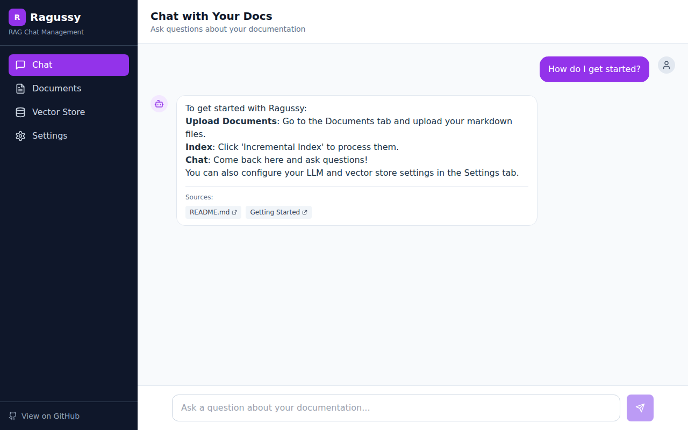
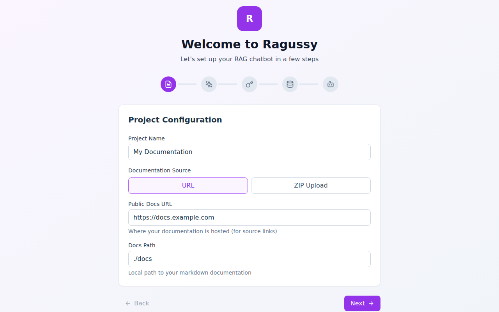
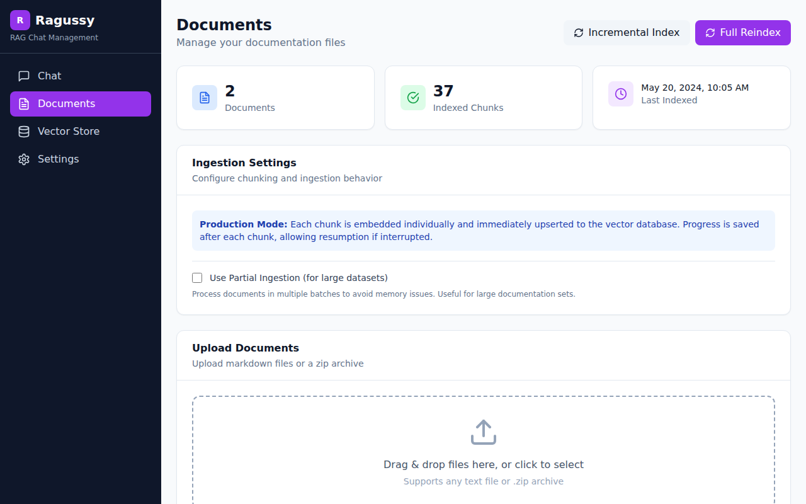
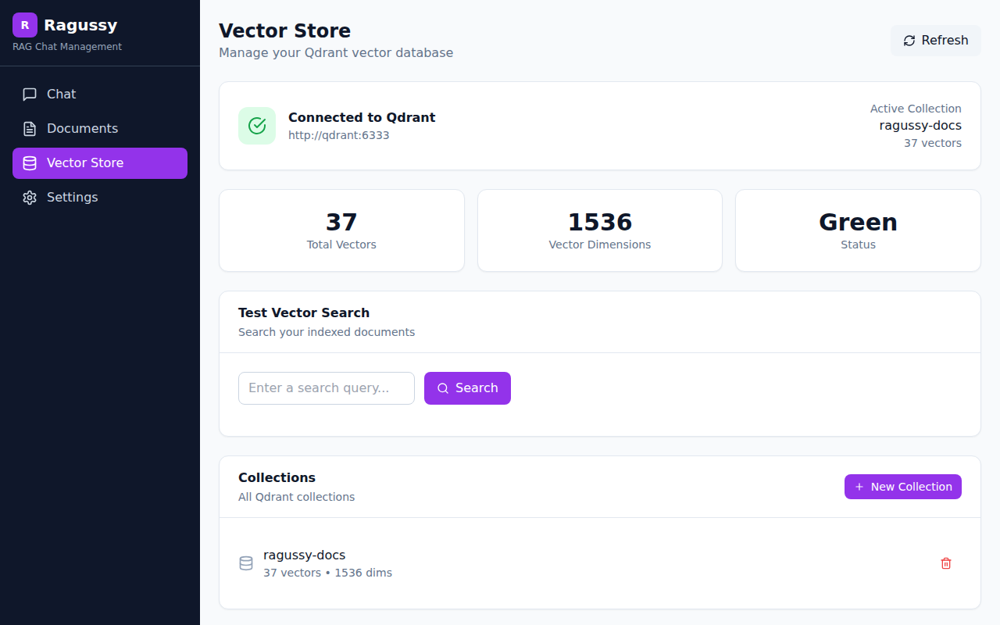

# Ragussy 🦝

A self-hosted RAG (Retrieval-Augmented Generation) chatbot optimized for Markdown documentation and forum discussions. Point it at your markdown docs and get an AI-powered Q&A system with complete control over configuration, documents, and vector storage.



## Features

- 🎨 **Full Management UI** - Configure everything from the browser
- 🧙 **Setup Wizard** - Guided configuration for API keys and settings
- 📚 **Document Management** - Upload, view, and manage your docs
- 🗄️ **Vector Store Control** - Manage Qdrant collections and search
- 💬 **Chat Interface** - Beautiful chat UI with source citations
- 📦 **Zip Upload** - Upload entire doc folders as zip files
- 🔌 **Flexible LLM Support** - OpenAI, OpenRouter, or any compatible API
- 🤖 **Discord Bot** - Optional Discord integration with slash commands
- 🐳 **Docker Ready** - Full Docker Compose setup included

## Quick Start

### One-Command Install

```bash
# Clone the repository
git clone https://github.com/mojomast/ragussy.git
cd ragussy

# Run the install script
# Linux/Mac:
./install.sh

# Windows (PowerShell):
powershell -ExecutionPolicy Bypass -File install.ps1
```

### Manual Installation

```bash
# Clone
git clone https://github.com/mojomast/ragussy.git
cd ragussy

# Install all dependencies
npm install
cd frontend && npm install && cd ..

# Copy environment template
cp .env.example .env
```

### Start the Application

```bash
# Terminal 1: Start Qdrant
docker run -p 6333:6333 qdrant/qdrant

# Terminal 2: Start Ragussy (backend + frontend)
npm run dev:all
```

Open http://localhost:5173 - the setup wizard will guide you through configuration.

## Screenshots

### Setup Wizard
Configure API keys, embedding models, and vector database with a guided wizard.



### Chat Interface
Ask questions about your documentation with source citations.


### Document Management
Upload, view, and manage your markdown documentation.



### Vector Store
Monitor and manage your Qdrant vector collections.



## Configuration

All configuration is managed through the UI, but you can also edit `.env` directly:

```env
# Project
PROJECT_NAME=My Documentation
PUBLIC_DOCS_BASE_URL=https://docs.example.com
DOCS_PATH=./docs

# LLM (OpenAI-compatible)
LLM_BASE_URL=https://api.openai.com/v1
LLM_API_KEY=sk-...
LLM_MODEL=gpt-4o-mini

# Embeddings
EMBED_BASE_URL=https://api.openai.com/v1
EMBED_API_KEY=sk-...
EMBED_MODEL=text-embedding-3-small

# Vector Database
QDRANT_URL=http://localhost:6333
QDRANT_COLLECTION=docs
VECTOR_DIM=1536

# Security (auto-generated by setup wizard)
API_KEY=your-api-key
ADMIN_TOKEN=your-admin-token
```

### Supported LLM Providers

| Provider | Base URL |
|----------|----------|
| OpenAI | `https://api.openai.com/v1` |
| OpenRouter | `https://openrouter.ai/api/v1` |
| Requesty.ai | `https://router.requesty.ai/v1` |
| Custom | Any OpenAI-compatible endpoint |

## Usage

### Adding Documents

1. **Via UI**: Go to Documents → drag & drop files or click to upload
2. **Zip Upload**: Upload a .zip file containing your markdown docs
3. **Manual**: Place .md/.mdx files in the `docs/` folder

### Indexing

After adding documents, click "Incremental Index" to process new/changed files, or "Full Reindex" to rebuild everything.

#### Forum Mode

For forum/discussion data, use the dedicated forum ingestion mode:

```bash
npm run ingest:forum              # Ingest from default docs path
npm run ingest:forum ./forum-data # Ingest from specific directory
npm run ingest:forum --config     # Show current configuration
```

Forum mode treats each post as the primary ingestion unit, preserving author attribution, timestamps, and thread context. See [Forum Ingestion](#forum-ingestion) for details.

### Chat

1. Go to the Chat page
2. Enter your API key (from Settings → Security)
3. Start asking questions!

## API Reference

### Chat Endpoint

```bash
POST /api/chat
Headers:
  Content-Type: application/json
  x-api-key: YOUR_API_KEY

Body:
{
  "message": "How do I get started?",
  "conversationId": "optional-for-context"
}
```

### Admin Endpoints

```bash
# Trigger reindex
POST /api/admin/reindex
Authorization: Bearer YOUR_ADMIN_TOKEN

# Full reindex
POST /api/admin/reindex/full
Authorization: Bearer YOUR_ADMIN_TOKEN
```

### Health Check

```bash
GET /api/health
GET /api/health/detailed
```

## Docker Deployment

```bash
# Build and start everything
docker compose up -d --build

# With Discord bot
docker compose --profile with-discord up -d --build

# View logs
docker compose logs -f ragussy

# Stop
docker compose down
```

## Discord Bot

Ragussy includes an optional Discord bot for answering questions directly in Discord.

### Quick Setup

1. Create a Discord app at [Discord Developer Portal](https://discord.com/developers/applications)
2. Create a bot and enable "Message Content Intent"
3. Copy the Bot Token and Client ID
4. Configure in the Setup Wizard or Settings page

### Running the Bot

```bash
cd discord-bot
npm install
npm run setup    # Interactive configuration
npm run register # Register slash commands
npm run dev      # Start the bot
```

### Docker

```bash
# Start with Discord bot
docker compose --profile with-discord up -d
```

### Commands

| Command | Description |
|---------|-------------|
| `/ask <question>` | Ask a question about the docs |
| `/status` | Check bot health |
| `/help` | Show help |
| `!docs <question>` | Message command (customizable prefix) |

See [discord-bot/README.md](discord-bot/README.md) for full documentation.

## Project Structure

```
ragussy/
├── src/                    # Backend source
│   ├── cli/               # CLI tools (setup, ingest, ingest-forum)
│   ├── config/            # Configuration
│   ├── ingestion/         # Document processing
│   │   └── forum/         # Forum ingestion mode
│   ├── routes/            # API endpoints
│   └── services/          # Qdrant & LLM
├── frontend/              # React frontend
│   ├── src/
│   │   ├── components/    # UI components
│   │   └── pages/         # Page components
│   └── ...
├── discord-bot/           # Discord bot
│   ├── src/
│   │   ├── commands/      # Slash commands
│   │   ├── config/        # Bot configuration
│   │   └── services/      # RAG API client
│   └── ...
├── docs/                  # Your documentation
├── install.sh             # Linux/Mac installer
├── install.ps1            # Windows installer
└── docker-compose.yml     # Docker setup
```

## Development

```bash
# Backend only
npm run dev

# Frontend only
npm run dev:frontend

# Both (recommended)
npm run dev:all

# Build for production
npm run build
```

## Embedding Models

| Model | Dimensions | Notes |
|-------|------------|-------|
| text-embedding-3-small | 1536 | Fast, good quality |
| text-embedding-3-large | 3072 | Best quality |
| text-embedding-ada-002 | 1536 | Legacy |
| baai/bge-m3 | 1024 | Recommended for forum mode |

The UI automatically sets the correct vector dimensions when you select a model.

## Forum Ingestion

Ragussy includes a dedicated forum ingestion mode optimized for threaded discussions and conversational retrieval.

### Features

- **Post-level chunking**: Each post is the primary ingestion unit (utterance model)
- **Rich metadata**: Author, timestamp, thread context, mentions, images
- **Deterministic IDs**: Safe retries and incremental ingestion
- **Change detection**: Skip unchanged posts via fingerprint comparison
- **Forum-aware retrieval**: Groups results by thread, surfaces multiple viewpoints

### Input Format

Forum data should be JSON files with this structure:

```json
{
  "threadId": "12345",
  "threadTitle": "Discussion Topic",
  "forumCategory": "General",
  "posts": [
    {
      "postId": "1",
      "threadId": "12345",
      "username": "user1",
      "userId": "100",
      "date": "2024-01-15T10:30:00.000Z",
      "content": "Original post content (quotes removed)",
      "contentFull": "Full content including quotes",
      "quotedContent": [{ "user": "other", "text": "quoted text" }],
      "images": ["https://..."],
      "mentions": ["user2"],
      "keywords": ["topic"],
      "fingerprint": "hash-for-change-detection",
      "isSubstantive": true
    }
  ]
}
```

### Usage

```bash
# Ingest forum data
npm run ingest:forum ./path/to/forum-data

# Show configuration
npm run ingest:forum --config

# Show example .env settings
npm run ingest:forum --env-example
```

### Configuration

Add to your `.env` file:

```env
# Enable forum mode
FORUM_MODE=true

# Ingestion settings
FORUM_MAX_TOKENS=800
FORUM_EMBEDDING_MODEL=baai/bge-m3
FORUM_EMBED_QUOTED_CONTENT=false
FORUM_EMBEDDING_THREADS=6
FORUM_SKIP_UNCHANGED=true

# Retrieval settings
FORUM_GROUP_BY_THREAD=true
FORUM_TIME_DECAY=false
FORUM_MAX_POSTS_PER_THREAD=10
FORUM_RETRIEVAL_COUNT=30
```

### Retrieval Behavior

Forum retrieval assumes:
- Posts may disagree with each other
- Advice may change over time
- No single post is authoritative

Results are grouped by thread and include user attribution and timestamps. The system says "users discussed" rather than "the forum states".

## Troubleshooting

### "Cannot connect to Qdrant"

Make sure Qdrant is running:
```bash
docker run -p 6333:6333 qdrant/qdrant
```

The backend will automatically retry connecting to Qdrant for up to 60 seconds on startup.

### "Invalid API key"

1. Go to Settings
2. Check your LLM and Embeddings API keys
3. Click "Test" to verify

### "Embedding dimension mismatch"

Your vector dimensions don't match the embedding model. Go to Settings → change the model, then do a Full Reindex.

### Documents not appearing

1. Check the docs path in Settings
2. Make sure files have .md or .mdx extension
3. Click refresh on the Documents page

### Re-running the Setup Wizard

If you need to reconfigure from scratch:
1. Go to Settings
2. Click "Re-run Setup" button
3. The wizard will appear on next page load

## Contributing

Contributions welcome! Please open an issue or PR.

## License

MIT License - Use it however you want!

---

Made with 💜 by [mojomast](https://github.com/mojomast)
